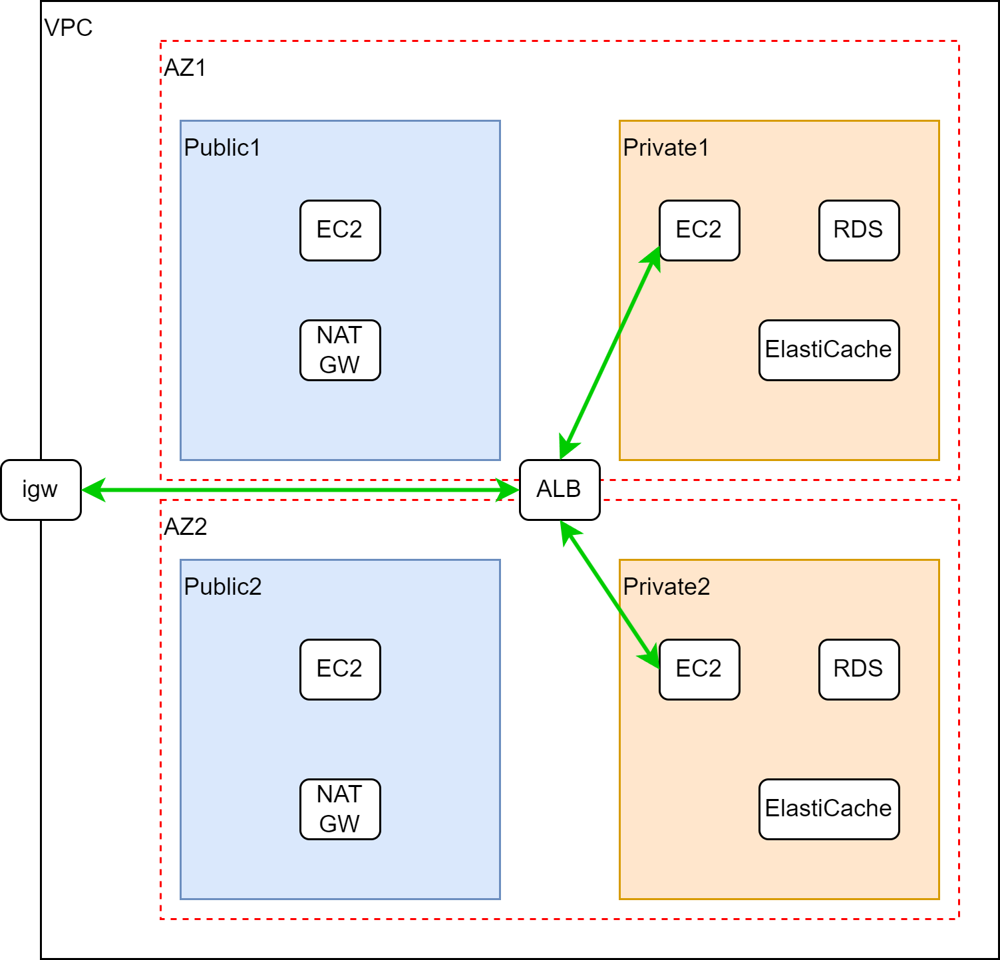

# Application CloudFormation Template

## Execution order of CloudFormation
* The files 3-ec2.yaml, 4-rds.yaml, and 5-elasticache.yaml can be executed in any order.
1. 1-network.yaml
2. 2-securitygroup.yaml
    - To avoid circular references, I am setting inbound/outbound rules after creating the security group.
3. 3-ec2.yaml
    - https://docs.aws.amazon.com/ja_jp/linux/al2023/release-notes/all-packages-al2023-20230517.html
4. 4-rds.yaml
    - Important to check mysql parameters
    - In RDS (MultiAZ), you cannot specify the Availability Zone (AZ) for the Primary instance. If you want to place the Primary in a specific AZ, you need to manually failover after creating the instance.
5. 5-elasticache.yaml
6. 6-applicationloadbalancer.yaml
7. 7-natgateway.yaml

## Security Group
* ALB_SG

    *Inbound Rule*

    | Type | Protocol | Port | Source |
    | ------ | --------- | ----- | ------ |
    | HTTPS  | TCP       | 443   | 0.0.0.0/0 |

    *Outbound Rule*

    | Type | Protocol | Port | Destination |
    | ------ | --------- | ----- | ------ |
    | HTTP   | TCP       | 80    | EC2_WEB_SG |

* EC2_WEB_SG

    *Inbound Rule*

    | Type | Protocol | Port | Source |
    | ------ | --------- | ----- | ------ |
    | HTTP   | TCP       | 80    | ALB_SG  |
    | SSH    | TCP       | 22    | EC2_GW_SG |

    *Outbound Rule*

    | Type | Protocol | Port | Destination |
    | ------ | --------- | ----- | ------ |
    | MYSQL  | TCP       | 3306  | RDS_SG |
    | Custom TCP | TCP  | 11211 | ElastiCache_SG |

* EC2_GW_SG

    *Inbound Rule*

    | Type | Protocol | Port | Source |
    | ------ | --------- | ----- | ------ |
    | SSH    | TCP       | 22    | Client IP |

    *Outbound Rule*

    | Type | Protocol | Port | Destination |
    | ------ | --------- | ----- | ------ |
    | SSH    | TCP       | 22    | EC2_WEB_SG |

* RDS_SG

    *Inbound Rule*

    | Type | Protocol | Port | Source |
    | ------ | --------- | ----- | ------ |
    | MYSQL  | TCP       | 3306  | EC2_WEB_SG |

    *Outbound Rule*

    | Type | Protocol | Port | Destination |
    | ------ | --------- | ----- | ------ |
    | All Traffic | All | All | EC2_WEB_SG |

* ElastiCache_SG

    *Inbound Rule*

    | Type | Protocol | Port | Source |
    | ------ | --------- | ----- | ------ |
    | Custom TCP | TCP | 11211 | EC2_WEB_SG |

    *Outbound Rule*

    | Type | Protocol | Port | Destination |
    | ------ | --------- | ----- | ------ |
    | All Traffic | All | All | EC2_WEB_SG |

## Network ACL(Public Subnet)
* Network ACLs are stateless, so it's necessary to set both inbound and outbound rules separately.
* You can use the default network ACL, but in this case, we will allow only the ports of the services being used.
* As the source IP address may change, we will basically set it as 0.0.0.0/0.

### Inbound Rule

| Rule Number | Protocol | Port Range | Source     | Action |
| ---------- | ---------- | ---------- | ---------- | --------------- |
| 100        | TCP (6)    | 22         | VPCSSHCIDR | Allow           |
| 101        | TCP (6)    | 80         | 0.0.0.0/0  | Allow           |
| 102        | TCP (6)    | 443        | 0.0.0.0/0  | Allow           |
| 103        | TCP (6)    | 1024-65535 | 0.0.0.0/0  | Allow           |
| *          | ALL        | ALL        | 0.0.0.0/0  | Deny            |

### Outbound Rule

| Rule Number | Protocol | Port Range | Destination | Action |
| ---------- | ---------- | ---------- | ----------------- | --------------- |
| 100        | TCP (6)    | 22         | 0.0.0.0/0         | Allow           |
| 101        | TCP (6)    | 80         | 0.0.0.0/0         | Allow           |
| 102        | TCP (6)    | 443        | 0.0.0.0/0         | Allow           |
| 103        | TCP (6)    | 1024-65535 | 0.0.0.0/0         | Allow           |
| *          | ALL        | ALL        | 0.0.0.0/0         | Deny            |

## Network ACL(Private Subnet)
### Inbound Rule

| Rule Number | Protocol | Port Range | Source     | Action |
| ---------- | ---------- | ---------- | ---------- | --------------- |
| 100        | TCP (6)    | 22         | 0.0.0.0/0  | Allow           |
| 101        | TCP (6)    | 80         | 0.0.0.0/0  | Allow           |
| 102        | TCP (6)    | 3306       | 0.0.0.0/0  | Allow           |
| 103        | TCP (6)    | 11211      | 0.0.0.0/0  | Allow           |
| *          | ALL        | ALL        | 0.0.0.0/0  | Deny            |

### Outbound Rule

| Rule Number | Protocol | Port Range | Destination | Action |
| ---------- | ---------- | ---------- | ----------------- | --------------- |
| 100        | TCP (6)    | 80         | 0.0.0.0/0         | Allow           |
| 101        | TCP (6)    | 443        | 0.0.0.0/0         | Allow           |
| 102        | TCP (6)    | 1024-65535 | 0.0.0.0/0         | Allow           |
| *          | ALL        | ALL        | 0.0.0.0/0         | Deny            |
